# 👋 Hi, I'm Nafeel

### First-Year Information Technology Undergraduate

I'm a first-year undergraduate at the **Faculty of Information Technology,
University of Moratuwa**, currently building a strong foundation in
programming and software development.

I'm developing my skills through hands-on projects, problem solving, and
exploring real-world software development practices. I'm particularly
interested in understanding how software is designed, developed, tested,
and maintained.

## 🌱 Currently Learning

- Programming fundamentals and problem solving
- Python development
- Git and GitHub
- Collaborative software development
- Data analysis and visualization
- Writing clean, organized, and maintainable code

## 🛠️ Skills & Technologies

### Languages & Query
- Python
- JavaScript
- SQL

### Web Technologies
- HTML
- CSS

### Tools & Version Control
- Git
- GitHub

## 🎓 Education

**University of Moratuwa**  
Faculty of Information Technology  
**BSc (Hons) in Information Technology and Management**  
📍 Moratuwa, Sri Lanka  
📚 First-Year Undergraduate

## 🌱 Learning & Practice

### Personal Portfolio
A personal portfolio website built while learning HTML, CSS, and JavaScript.

### Git & GitHub Collaborative Assignment
A university learning activity focused on Git, GitHub, branching, pull requests, code reviews, and merge conflicts.

### SpeedQuiz
A forked repository used to explore and learn from a real-time web application.

## 🚀 My Goals

My goal is to continuously strengthen my technical skills, build meaningful
projects, gain practical experience, and grow into a skilled software
developer.

I believe in learning step by step, building consistently, and improving
through every project and challenge.

## 📚 Current Focus

I'm currently focused on developing my programming fundamentals and becoming
comfortable with professional development practices such as version control,
branching, pull requests, code reviews, and collaborative development.

> 💡 Learning today, building tomorrow.

## 📊 GitHub Stats

